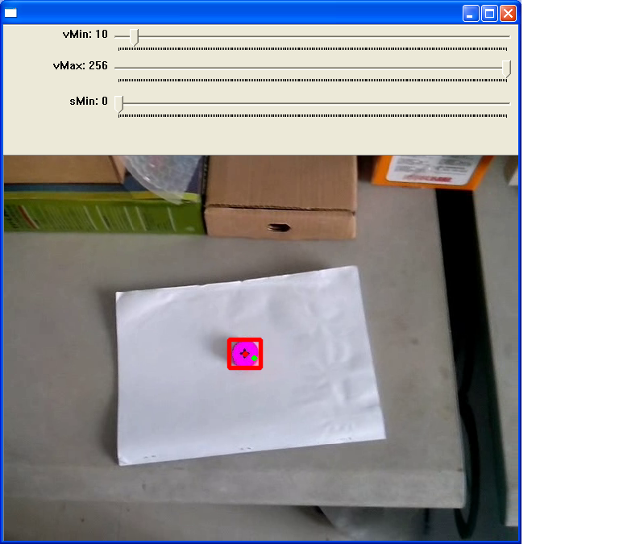
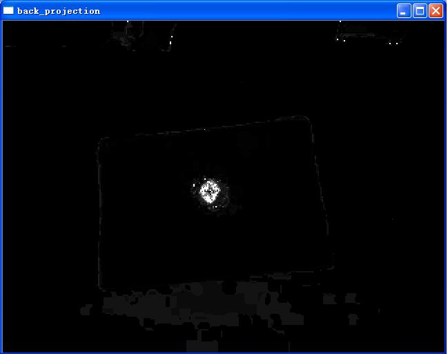
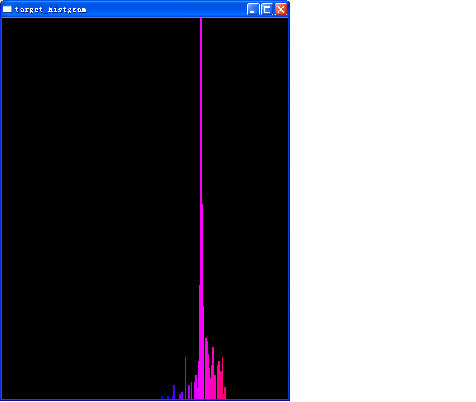
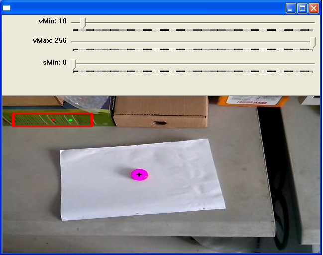
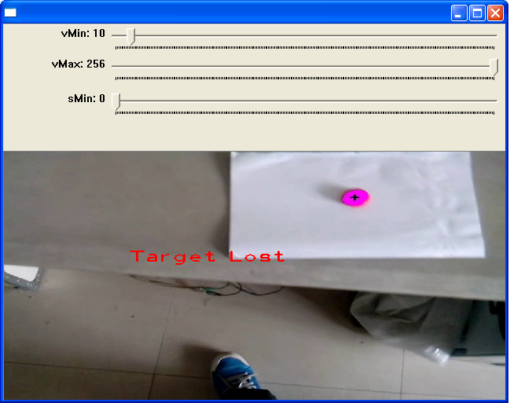
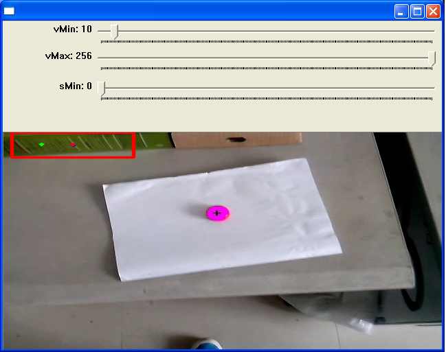

camshiftKalman
==============

An object tracking project using camshift and Kalman Filter based on OpenCV.

I implement this object tracking algorithm using camshift and Kalman Filter. Three features, hue,saturation and rotation invariant Local Binary Pattern, are used to model the tracking object. Kalman Filter is employed to smooth the motion trajectory and predict the next position when the object is occluded.

Requirements
================
> - OpenCV(http://opencv.org/)

Usage
================
For linux :
```
./camShiftKalman -m option -t option -v option
```
For windows :
```
(using cmd change directory to camShiftKalman)
cd path/to/this/drorectory
camShiftKalman -m option -t option -v option
```
Detail usage :
```
  -m, --useMouse=[true]    how to choose object to track
  -t, --featureType=[0]    0 -- HUE
  						   1 -- SATURATION_HUE (need to implement)
                           2 -- LBP_HUE (need to implement)
                           3 -- LBP_SATURATION_HUE
  -v, --videoName          the video to track
```
Screenshot
=============
only show result on one video




If we choose another object

when the obejct can not be captured

when the object appears again

Contact
=============
If you any questions about this project, please contact me directly.  
E-mail : chengshaoguang1291@gmail.com  
From Northwestern Polytechnical University.
